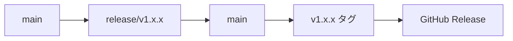

# Contributing to Unity Project Template

Unity Project Templateプロジェクトへのご協力をありがとうございます！  
このガイドでは、効率的に開発に参加するための手順とルールを説明します。

---

## 📋 目次

- [開発環境の準備](#-開発環境の準備)
- [開発ワークフロー](#-開発ワークフロー)
- [コード品質の維持](#-コード品質の維持)
- [リリース手順](#-リリース手順)
- [コミュニティサポート](#-コミュニティサポート)

---

## 🛠 開発環境の準備

### 必要なソフトウェア

| ソフトウェア | バージョン | 用途                 |
| ------------ | ---------- | -------------------- |
| Unity        | 6000.0 LTS | ゲーム開発エンジン   |
| Node.js      | 20.x以上   | 開発ツール・自動化   |
| .NET SDK     | 8.x以上    | C#コンパイル・テスト |
| Git          | 最新版     | バージョン管理       |

### セットアップ手順

#### 1. プロジェクトの取得

```bash
git clone [repository-url]
cd vroid-game-template
```

#### 2. 開発ツールのインストール

```bash
npm install
```

#### 3. Unity プロジェクトを開く

Unity Hub から本プロジェクトを開いてください。

---

## 🔄 開発ワークフロー

### ブランチ戦略

このプロジェクトでは、作業内容によってブランチを分けて開発します：

| 作業内容     | ブランチ名          | 使い道       | 例                          |
| ------------ | ------------------- | ------------ | --------------------------- |
| 新機能追加   | `feature/機能名`    | 新機能の開発 | `feature/vr-avatar-setup`   |
| バグ修正     | `fix/修正内容`      | 不具合の修正 | `fix/animation-memory-leak` |
| コード整理   | `refactor/対象範囲` | コード改善   | `refactor/add-event-bridge` |
| 緊急修正     | `hotfix/緊急修正`   | 緊急バグ修正 | `hotfix/navmesh-crash`      |
| リリース準備 | `release/v1.x.x`    | リリース準備 | `release/v1.2.0`            |

### コミットルール

#### コミットメッセージ形式

[Conventional Commits](https://www.conventionalcommits.org/) 仕様に従います：

```md
<type>[(scope)]: <description>

[optional body]

[optional footer(s)]
```

#### 実例

```bash
# ✅ 良い例
feat(ui): ユーザー設定画面を追加
fix(vr): アバター読み込み時のメモリリークを修正
docs: README の環境設定手順を更新

# ❌ 悪い例
update code
fix bug
```

#### コミットタイプ一覧

| タイプ     | 説明               | 例                                   |
| ---------- | ------------------ | ------------------------------------ |
| `feat`     | 新機能追加         | `feat(avatar): VRM1.0対応を追加`     |
| `fix`      | バグ修正           | `fix(input): タッチ操作の不具合修正` |
| `docs`     | ドキュメント更新   | `docs: API仕様書を更新`              |
| `style`    | コードフォーマット | `style: C#コードをフォーマット`      |
| `refactor` | リファクタリング   | `refactor(scene): シーン管理を改善`  |
| `test`     | テスト関連         | `test: ユニットテストを追加`         |
| `perf`     | パフォーマンス改善 | `perf: メモリ使用量を最適化`         |
| `build`    | ビルドシステム     | `build: IL2CPP設定を更新`            |
| `ci`       | CI/CD設定          | `ci: GitHub Actions を追加`          |
| `chore`    | その他             | `chore: 依存関係を更新`              |
| `revert`   | 変更の取り消し     | `revert: 前回のコミットを取り消し`   |

---

## ✨ コード品質の維持

### 自動フォーマット

以下のツールが **コミット時に自動実行** されます：

| 言語                  | ツール               | 設定ファイル                      |
| --------------------- | -------------------- | --------------------------------- |
| C#                    | CSharpier + StyleCop | `.editorconfig`, `stylecop.json`  |
| JavaScript/TypeScript | ESLint + Prettier    | `eslint.config.js`, `.prettierrc` |
| Markdown              | markdownlint         | `.markdownlint.json`              |

#### 📝 自動処理の内容

- **フォーマット**: コードスタイルの統一
- **静的解析**: 潜在的な問題の検出
- **再ステージング**: 修正されたファイルの自動追加

### 手動実行コマンド

```bash
# すべてをフォーマット
npm run format

# C# のみ
npm run format:cs

# JS/TS のみ
npm run format:js

# Markdown のみ
npm run format:md
```

### プルリクエストのルール

1. **レビュー**: 最低1人の承認が必要
2. **テスト**: 変更に対応するテストを追加
3. **説明**: 変更内容と理由を明確に記述
4. **CI**: すべてのチェックが通ること

### プルリクエストの手順

#### 1. 開発準備

```bash
# 最新のmainブランチを取得
git checkout main
git pull origin main

# 新しいブランチを作成
git checkout -b feature/new-animation-system
```

#### 2. 開発とコミット

```bash
# 変更をステージング
git add .

# ルールに従ってコミット
git commit -m "feat(animation): 新しいアニメーションシステムを追加"

# GitHubにプッシュ
git push origin feature/new-animation-system
```

#### 3. プルリクエスト作成

- **タイトル**: コミットメッセージと同じ形式
- **説明**: 何を変更したか、なぜ変更したか、テスト方法
- **ラベル**: 適切なラベルを付ける（bug, enhancement, documentation等）

#### 4. コードレビュー

レビューでチェックする項目：

- **UniTask/R3 の使い分け**: 適切な非同期処理の選択
- **メモリ使用量**: ガベージコレクションの負荷確認
- **エラー処理**: 例外処理の適切な実装
- **プラットフォーム対応**: iOS/Android対応の確認
- **リソース管理**: Addressablesの適切な解放

#### 5. マージ後のお片付け

```bash
# mainブランチに戻る
git checkout main
git pull origin main

# 使い終わったブランチを削除
git branch -d feature/new-animation-system
```

---

## 🚀 リリース手順

### リリースフロー概要

リリースは `release` ブランチを経由して安全に行います：



### 詳細手順

#### 1. リリースブランチの作成

```bash
# 新しいリリースブランチを作成
git switch -c release/v1.4.0
```

#### 2. CHANGELOG の更新

`CHANGELOG.md` で `Unreleased` セクションを正式版に変更：

```markdown
## [Unreleased]

↓

## [v1.4.0] - 2024-01-15
```

#### 3. リリースコミットの作成

```bash
# リリース準備コミット（タグは作成しない）
npm run release:prepare -- v1.4.0
```

#### 4. リリースブランチのプッシュ

```bash
git push -u origin HEAD
```

#### 5. プルリクエストの作成とマージ

GitHub上で `release/v1.4.0` → `main` のPRを作成してマージ

#### 6. タグの作成と公開

```bash
# main ブランチに切り替えて最新を取得
git switch main
git pull --ff-only

# タグを作成してプッシュ（GitHub Actions が起動）
npm run release:tag -- v1.4.0
```

#### ✅ 自動実行される処理

- GitHub Release の作成
- リリースノートの生成
- アーティファクトの配布

---

## 🤝 コミュニティサポート

### 質問・相談

| 種類     | 場所                                                            | 用途         |
| -------- | --------------------------------------------------------------- | ------------ |
| バグ報告 | [Issues](https://github.com/naoji3x/vroid-game-template/issues) | 不具合の報告 |
| 機能要求 | [Issues](https://github.com/naoji3x/vroid-game-template/issues) | 新機能の提案 |

### サポート範囲

- ✅ Unity 6000.0 LTS での開発
- ✅ VRM/VRoid関連の技術
- ✅ プロジェクト構成・設定
- ✅ 開発ワークフローの改善

### 貢献のお願い

このプロジェクトをより良くするために：

- 🐛 **バグ報告**: 詳細な再現手順と環境情報
- 💡 **機能提案**: 具体的なユースケースと実装案
- 📚 **ドキュメント**: 分かりにくい箇所の改善
- 🧪 **テスト**: カバレッジの向上

---

## **Happy Coding! 🎮✨**
